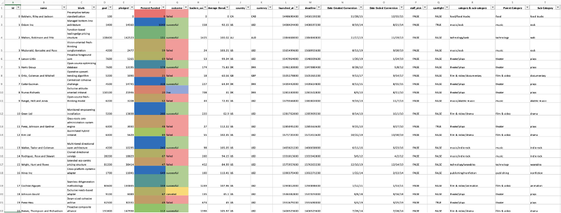
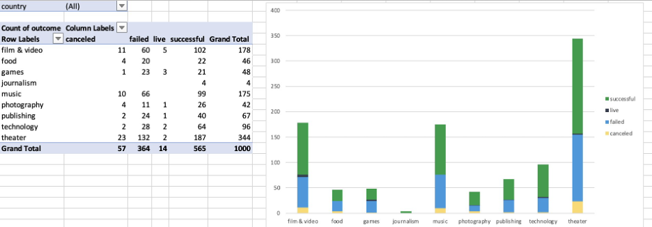
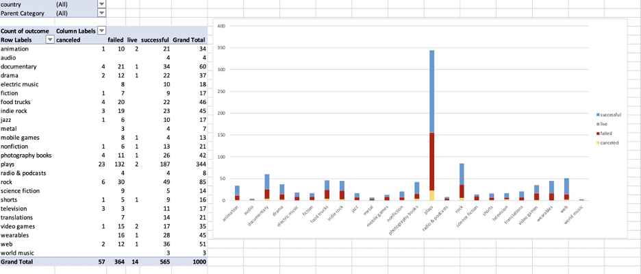
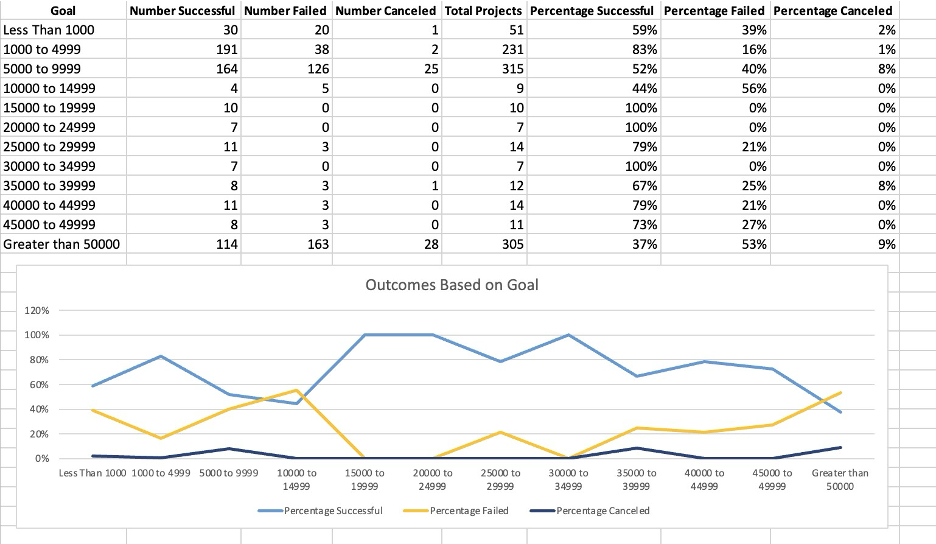
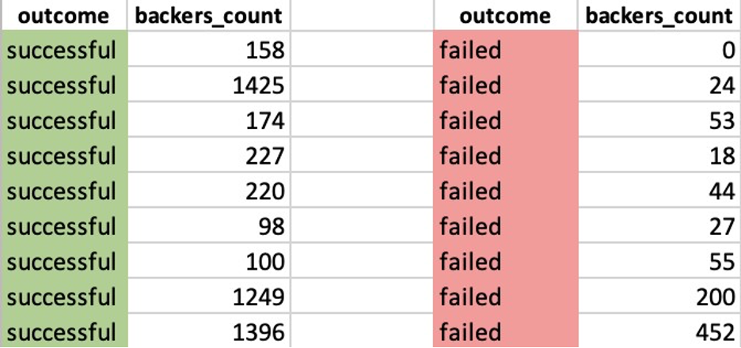

# Working_with_Excel
# Instructions

## Background

Crowdfunding platforms like Kickstarter and Indiegogo have been growing in success and popularity since the late 2000s. From independent content creators to famous celebrities, more and more people are using crowdfunding to launch new products and generate buzz, but not every project has found success. To receive funding, the project must meet or exceed an initial goal, so many organizations dedicate considerable resources looking through old projects in an attempt to discover “the trick” to finding success. For this week's Challenge, you will organize and analyze a database of 1,000 sample projects to uncover any hidden trends.

## Before You Begin

Create a new folder for this project called excel-challenge in either Dropbox or Google Drive.   
Do not add this Challenge to an existing repository.  
Store your Excel workbooks here in this new space, and create a sharable link for submission. 

## Files

Download the following files to help you get started: 
Module 1 Challenge files Links to an external site. 

## Instructions

Using the Excel workbook in your .zip file, modify and analyze the sample-project data and try to uncover market trends. 
Data for this dataset was generated by edX Boot Camps LLC, and is intended for educational purposes only.  
Use conditional formatting to fill each cell in the outcome column with a different color, depending on whether the associated campaign was successful, failed, canceled, or is currently live.  
Create a new column called Percent Funded that uses a formula to find how much money a campaign made relative to its initial funding goal.  
Use conditional formatting to fill each cell in the Percent Funded column according to a threecolor scale. The scale should start at 0 with a dark shade of red, and it should transition to green at 100 and blue at 200.  
Create a new column called Average Donation that uses a formula to find how much each project backer paid on average.  
Create two new columns, one called Parent Category and another called Sub-Category, that use formulas to split the Category and Sub-Category column into the two new, separate columns. 

Create a new sheet with a pivot table that analyzes your initial worksheet to count how many campaigns were successful, failed, canceled, or are currently live per category.  
Create a stacked-column pivot chart that can be filtered by country based on the table that you created.

Create a new sheet with a pivot table that analyzes your initial sheet to count how many campaigns were successful, failed, or canceled, or are currently live per sub-category. Create a stacked-column pivot chart that can be filtered by country and parent category based on the table that you created.  
The dates in the deadline and launched_at columns use Unix timestamps.  
Fortunately for us, this [formula](https://www.extendoffice.com/documents/excel/2473-excel-timestamp-to-date.html). 
that can be used to convert these timestamps to a normal date.  
Create a new column named Date Created Conversion that will use this [formula](https://www.extendoffice.com/documents/excel/2473-excel-timestamp-to-date.html) to convert the data contained in launched_at into Excel's date format.  
Create a new column named Date Ended Conversion that will use this formula to convert the data contained in deadline into Excel's date format. 
Create a new sheet with a pivot table that has a column of outcome, rows of Date Created Conversion, values based on the count of outcome, and filters based on parent category and Years.  
Now, create a pivot-chart line graph that visualizes this new table.  
Create a report in Microsoft Word, and answer the following questions: 
Given the provided data, what are three conclusions that we can draw about crowdfunding campaigns?  
What are some limitations of this dataset?  
What are some other possible tables and/or graphs that we could create, and what additional value would they provide? 

## Crowdfunding Goal Analysis

Create a new sheet with 8 columns:  
Goal  
Number Successful  
Number Failed  
Number Canceled  
Total Projects  
Percentage Successful  
Percentage Failed  
Percentage Canceled  
In the Goal column, create 12 rows with the following headers:  
Less than 1000  
1000 to 4999  
5000 to 9999  
10000 to 14999  
15000 to 19999  
20000 to 24999  
25000 to 29999  
30000 to 34999  
35000 to 39999  
40000 to 44999  
45000 to 49999  
Greater than or equal to 50000  
Using the COUNTIFS() formula, count how many successful, failed, and canceled projects were created with goals within the ranges listed above. Populate the Number Successful, Number Failed, and Number Canceled columns with these data points.  
Add up each of the values in the Number Successful, Number Failed, and Number Canceled columns to populate the Total Projects column. Then, using a mathematical formula, find the percentage of projects that were successful, failed, or canceled per goal range. Create a line chart that graphs the relationship between a goal amount and its chances of success, failure, or cancellation.  

## Statistical Analysis

Most people would use the number of campaign backers to assess the success of a crowdfunding campaign. Creating a summary statistics table is one of the most efficient ways that data scientists can characterize quantitative metrics, such as the number of campaign backers.  
For gaining an in-depth understanding of campaign backers, evaluate the number of backers of successful and unsuccessful campaigns by creating your own summary statistics table. Create a new worksheet in your workbook, and create one column for the number of backers of successful campaigns and one column for unsuccessful campaigns.

Use Excel to evaluate the following values for successful campaigns, and then do the same for unsuccessful campaigns:  
The mean number of backers  
The median number of backers  
The minimum number of backers  
The maximum number of backers  
The variance of the number of backers  
The standard deviation of the number of backers  
Use your data to determine whether the mean or the median better summarizes the data. Use your data to determine if there is more variability with successful or unsuccessful campaigns. Does this make sense? Why or why not?  

## Requirements
#### Conditional Formatting (10 points)
Conditional formatting is applied appropriately to the outcome column (5 points)  
Conditional formatting is applied appropriately to the percent funded column (5 points)  
#### Column Creation (10 points)
Six new columns were correctly created for:  
percent funded average donation category sub-category  
Date Created Conversion  
Date Ended Conversion  
#### Pivot Tables and Stacked Column Charts (15 points)
Correctly created a pivot table that counts how many campaigns were "successful," "failed,", "canceled," or are currently "live" per category (7.5 points)  
Correctly created a stacked column pivot chart that can be filtered by country (7.5 points)  
#### Pivot Tables and Line Graphs (15 points) 
Correctly created a pivot table with a column of outcome, rows of Date Created Conversion, values based on the count of outcome, and filters based on parent category and Years (7.5 points)  
Correctly created a pivot chart line graph (7.5 points)  
#### Written Report (20 points) 
Presents a cohesive written analysis that:  
Draws three conclusions from the data (10 points)  
States limitations of the dataset and suggestions for additional tables of graph (10 points)  
#### Crowdfunding Goal Analysis (10 points) 
Computed calculations of percentages for projects that were successful, failed, or were canceled per goal range (5 points)  
Created a line chart showing the relationship between the goal’s amount and its chances at success, failure, or cancellation (5 points)  
#### Statistical Analysis (20 points)
Computed calculations of the mean, median, min, max, variance, and stdev using Excel formulas (15 points)  
A brief and compelling justification of whether the mean or median better summarizes the data (5 points)

